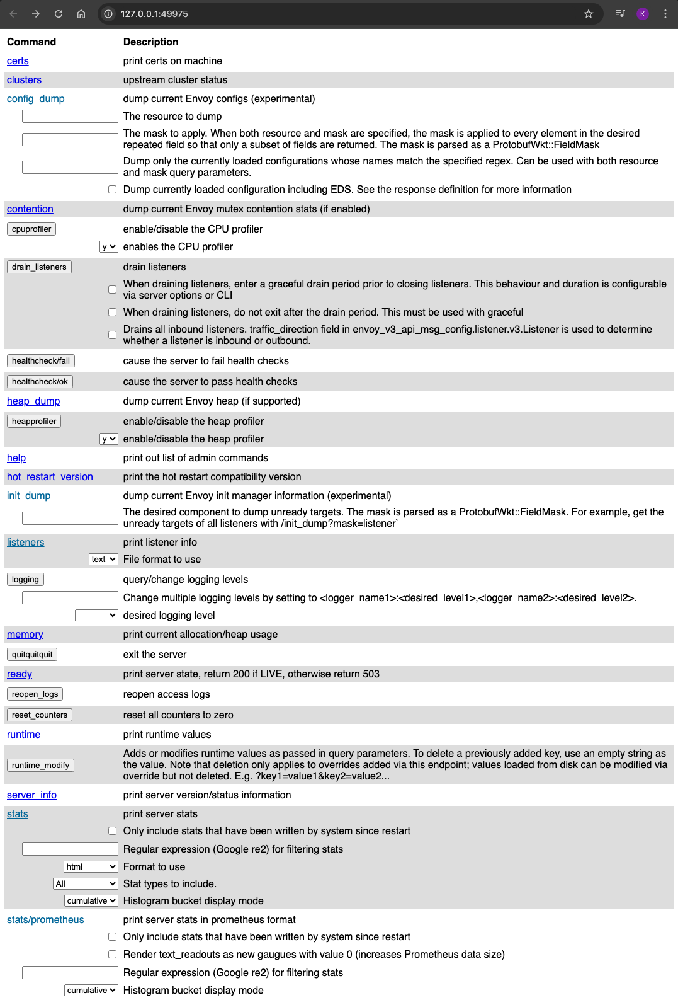

# Envoy IronClad Distributed Rate Limiter

## Introduction

Welcome to `envoy-ironclad-dist-rate`! This project explores the challenge of managing a background process workload that calls an external API with a strict rate limit.  Exceeding API rate limits can lead to lockout periods and service outages, making it crucial to control egress to these APIs effectively.

In this repository, we demonstrate using Envoy Proxy to ensure a combined workload honors externally enforced API limits. We will also harden the configuration from a cybersecurity perspective.

We will use Google’s Geocoding API for demonstration purposes.

## Architecture and Components

1. **Envoy Proxy**: Serves as the central rate limiting and caching mechanism for external APIs. It's configured to handle API requests and enforce rate limits, ensuring the total outbound rate of requests does not exceed external restrictions. Services within the environment call an endpoint configured on Envoy which either returns HTTP error code 429 when limits have been exceeded or proxies the request to the downstream API. 

    [Envoy Proxy](https://www.envoyproxy.io/)


2. **Curl Script**: Runs within a Kubernetes deployment, making periodic API requests through the Envoy proxy. It includes logic to randomize request intervals and perform exponential backoff when API rate limits are exceeded. The included helm chart provides parameters for controlling this behaviour.

    [cURL GitHub](https://github.com/curl/curl)
    
    [jq GitHub](https://github.com/stedolan/jq)

3. **Kubernetes Infrastructure**: Utilizes multiple Kubernetes resources, including ConfigMaps, Deployments, Namespaces, NetworkPolicies, Secrets, and Services, to manage and orchestrate components.

    [Kubernetes Concepts](https://kubernetes.io/docs/concepts/)

4. **Geocode API**: The Google Geocode API is utilized for reverse geocoding, translating latitude and longitude into human-readable addresses. The API provides accurate and detailed location information, essential for various applications. The Envoy proxy manages the interaction with this API, ensuring rate limits are respected and requests are handled efficiently.

    [Google Maps Geocoding API Overview](https://developers.google.com/maps/documentation/geocoding/overview)

## Security

The `envoy-ironclad-dist-rate` project has been designed with multiple security measures to ensure a robust and secure deployment. Below are the specific security configurations implemented:

1. **Run Container as a Non-Root User**
   - All containers are configured to run as non-root users. This reduces the risk of privilege escalation attacks.

2. **Mount Filesystem Read-Only**
   - All containers are configured with read-only filesystems, which prevents any unauthorized changes to the filesystem.

3. **Log to /dev/stdout**
   - Since the filesystem is read-only, logs are directed to `/dev/stdout`, ensuring that logging does not require write permissions.
   - [Envoy Command Line Options - Log Path](https://www.envoyproxy.io/docs/envoy/latest/operations/cli.html#cmdoption-log-path)
   - [Envoy Admin Configuration - Envoy Documentation](https://www.envoyproxy.io/docs/envoy/latest/api-v3/config/bootstrap/v3/bootstrap.proto.html#config-bootstrap-v3-admin)

4. **Enable Seccomp Default Runtime Profile**
   - Seccomp (secure computing mode) profiles are used to limit the system calls a container can make, reducing the kernel's attack surface.
   - [Seccomp Profiles - Kubernetes Documentation](https://kubernetes.io/docs/tutorials/clusters/seccomp/)

5. **Drop Unnecessary Linux Capabilities**
   - To follow the principle of least privilege, all unnecessary Linux kernel capabilities are dropped.
   - [Linux Capabilities - man7.org](https://man7.org/linux/man-pages/man7/capabilities.7.html)


6. **Enable Secure Network Policies**
   - Network policies are implemented to control the ingress and egress traffic to and from the pods, ensuring that only necessary communication is allowed.

7. **Enforce Restricted Pod Security Policy Level**
   - The `envoy` namespace is labeled to enforce `restricted` security policies, ensuring that only the most secure pod configurations are permitted. This helps prevent privilege escalation and restricts the capabilities available to the pods. This policy is the most stringent, restricting pods to only the safest configurations. It ensures that pods run with non-root users, use read-only filesystems, and do not have access to sensitive kernel capabilities.


By implementing these security measures, the `envoy-ironclad-dist-rate` project ensures a secure and stable environment for handling geocoding requests through Envoy, maintaining both functionality and security best practices.

:warning: A production implementation should include Pod-to-Pod TLS encryption. This feature will be added to `envoy-ironclad-dist-rate` in the future. Please check back for updates!


## Project Structure

```
.
├── README.md                           # Project documentation
├── assets                              # Directory containing various assets for the project
│   └── ...                             # Images
├── docker/
│   └── Dockerfile                      # Dockerfile for building the curl-loop image
├── helm/
│   ├── Chart.yaml                      # Helm chart metadata
│   ├── templates
│   │   ├── curl-configmap.yaml         # ConfigMap for curl script
│   │   ├── curl-deployment.yaml        # Deployment configuration for curl-loop
│   │   ├── curl-secret.yaml            # Secret for storing sensitive API keys
│   │   ├── envoy-admin-service.yaml    # Service definition for Envoy admin interface
│   │   ├── envoy-configmap.yaml        # ConfigMap for Envoy configuration
│   │   ├── envoy-deployment.yaml       # Deployment configuration for Envoy
│   │   ├── envoy-networkpolicy.yaml    # Network policy for securing communications
│   │   └── envoy-service.yaml          # Service definition for Envoy
│   └── values.yaml                     # Values for configuring the Helm chart
├── manifests/
│   └── envoy-ns.yaml                   # Namespace definition with Pod Security Standard labels
└── setup.sh                            # Script to setup environment and dependencies
```

## Required Software

Below are the installation links for the packages required to run this demo:

- [Cilium - Kubernetes-Native Container Networking](https://docs.cilium.io/en/stable/gettingstarted/k8s-install-default/)
- [Docker - Container Runtime](https://docs.docker.com/engine/install/)
- [Helm - Kubernetes Package Manager](https://helm.sh/docs/intro/install/)
- [Kubectl - Kubernetes Command-Line Administration Tool](https://kubernetes.io/docs/tasks/tools/install-kubectl/)
- [Minikube - Local Kubernetes Cluster](https://minikube.sigs.k8s.io/docs/start/)
- [Hubble - Network Visibility for Cilium](https://docs.cilium.io/en/stable/gettingstarted/hubble_setup/)

## Initial Setup

A `setup.sh` script is provided in the root of the repository

```bash
bash setup.sh
```


Verify the setup

```bash
kubectl get all --all-namespaces
```
The output should be similar to below


## Envoy Ironclad Distributed Rate Limiter Helm Chart

This Helm chart deploys an Envoy proxy along with two pods runing a custom script utilizing cURL to demonstrate Envoy’s rate limiting and caching capabilities aimed at efficiently interfacing with the Google reverse geocoding API.

## Configuration Parameters

| Parameter                | Description                                       | Default Value                                           |
|--------------------------|---------------------------------------------------|---------------------------------------------------------|
| `envoy.image`            | Docker image for the Envoy proxy.                 | `envoyproxy/envoy@sha256:...`                           |
| `envoy.logLevel`         | Logging level of the Envoy proxy.                 | `debug`                                                 |
| `envoy.maxTokens`        | Maximum tokens for rate limiting.                 | `5`                                                     |
| `envoy.tokensPerFill`    | Tokens added per interval.                        | `5`                                                     |
| `envoy.fillInterval`     | Interval for adding tokens.                       | `15s`                                                   |
| `curl.sleep`             | Sleep duration between requests in seconds.       | `1`                                                     |
| `curl.maxSleep`          | Max sleep time (seconds) for exponential backoff  | `10`                                                    |
| `curl.jitter`            | Max random delay before cURL pods send API calls. | `4`                                                     |
| `curl.staticFrequency`   | Frequency of using static latitude and longitude. | `6`                                                     |
| `curl.staticLatlng`      | Static coordinates for API requests.              | `"37.789980,-122.400860"`                               |
| `curl.googleApiKey`      | API key for Google Geocode API.                   | (Set at runtime)                                        |
| `curl.maxAge`            | Cache control max-age in seconds.                 | `3600`                                                  |
| `curl.replicas`          | Starting number of cURL pods                      | `2`                                                     |

## Installation

Assuming you have kubectl connectivity to your cluster, the helm chart can be deployed from the root of the repository with:

```bash
set +o history # disable shell history
```
```bash
helm install envoy-ironclad-dist-rate ./helm/envoy-ironclad-dist-rate --namespace envoy-ironclad-dist-rate --set curl.googleApiKey=CLEARTEXT
```

```bash
NAME: envoy-ironclad-dist-rate
LAST DEPLOYED: Mon Aug  5 08:18:03 2024
NAMESPACE: envoy-ironclad-dist-rate
STATUS: deployed
REVISION: 1
TEST SUITE: None
```

```bash
set -o history # enable shell history
```
## Activities

### View Pod Logs and Observe API Calls

Envoy returns HTTP error code 429 when limits have been exceeded

- `kubectl logs -f --selector app=curl-loop`

   

- `kubectl logs -f --selector app=envoy`

### Explore Network Traffic

- `cilium hubble port-forward&`
- `hubble observe --namespace envoy-ironclad-dist-rate --follow`

   

### View Envoy Admin Web Interface

- `minikube service envoy-admin --url -n envoy-test`



## Cleanup

```bash
minikube delete
```

# Coming Soon! :construction:

- Fix Intermittent jq Parsing Error on cURL Output
- TLS Encrypted Pod-to-Pod Communications
- Envoy Redis Backed Cache
- Architecture Diagram
- More Goodies!